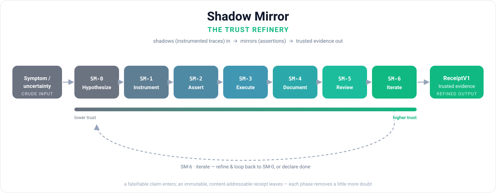

# Shadow Mirror

[](https://github.com/acidblock/shadow-mirror/actions/workflows/ci.yml)
[](LICENSE)
[](pyproject.toml)

**Referential introspection for test planning and coverage mapping.**

> Line coverage tells you what *ran*. Shadow Mirror tells you what's *proven* —
> and what to test next.



Shadow Mirror is a validation methodology — and a Claude Code plugin — that turns
a falsifiable hypothesis into durable evidence. It anchors coverage to an
**operation tree** scored across five **levels** (functional / behavioral /
performant / resilient / observable), measuring the *semantic* coverage gap
between "executed" and "proven" that line-coverage tools cannot see — one engine
and the same five levels across **Python, JavaScript, TypeScript, and TSX**
(pytest + coverage.py, vitest + Istanbul), behind a single language adapter SPI.

This repository is both the **methodology spec** and a **Claude Code plugin
marketplace** that ships it.

## Install the plugin

```bash
claude plugin marketplace add acidblock/shadow-mirror
claude plugin install shadow-mirror@shadow-mirror
```

Then run `/shadow-mirror`, or ask Claude to validate, plan tests for, or map
coverage on something — the skill triggers automatically. See
[`plugin/README.md`](plugin/README.md) for what the plugin bundles.

**Reviewing your own project?** [`docs/reviewing-a-repo.md`](docs/reviewing-a-repo.md)
is the three-command quickstart — Python and JS/TS/TSX, the one prerequisite, the
review flow (`map` → `plan` → PR `delta`), and the self-verifying `EvidenceBundle`
you hand back.

## The seven-phase loop (SM-0 .. SM-6)

```
SM-0 Hypothesize  →  state a falsifiable claim about a symptom
SM-1 Instrument   →  choose probes that can answer the SM-0 question
SM-2 Assert       →  generate predicates that accumulate toward proof
SM-3 Execute      →  run, collect traces / metrics / outcomes
SM-4 Document     →  emit a durable, content-addressable evidence receipt
SM-5 Review       →  meta-validate: coverage, assertion quality, soundness
SM-6 Iterate      →  refine and loop, or declare done
```

One engine, two directions:

- **Forward — test planning** (SM-0→SM-2): given code or a diff, produce a *plan*
  — the gaps and the assertion stubs to close them.
- **Backward — coverage mapping** (SM-3→SM-5): given existing tests, produce a
  *map* — the operation tree scored per node, per level, with the blind spots
  line coverage hides.

## Repository layout

```
.
├── .claude-plugin/marketplace.json   # one-plugin marketplace
├── plugin/                           # the shadow-mirror plugin (skill, command, agent)
├── shadow_mirror/                    # reference model (Phase, ReceiptV1, EvidenceBundle) + the sm engine + language adapters
├── tests/                            # conformance + engine suite
├── pyproject.toml                    # build config (PyPI target)
├── docs/
│   ├── phases.md                     # canonical SM-0..SM-6 phase definitions
│   ├── receipt-format-v1.md          # frozen v1 evidence-receipt wire format
│   ├── evidence-bundle.md            # receipt + canonical map embedded, self-verifying
│   ├── coverage-levels.md            # five-level rubric (v2)
│   ├── constraints.md                # C1–C5 invariant registry
│   ├── examples/                     # grounded-loop walkthrough + a CI Action template
│   ├── spikes/                       # P1/P7 de-risking spikes (measured, not assumed)
│   └── trust-refinery.svg            # the loop as a refinery diagram
├── SHADOW_MIRROR_INTERFACE.md        # the complete public surface: CLI, library, MCP, SPI, wire formats
├── ROADMAP.md                        # path to "preferred" introspection tool
└── LICENSE                           # Apache-2.0
```

## Use the library

The reference data model conforms to the specs in `docs/` and has no runtime
dependencies:

```python
from shadow_mirror import ReceiptV1, Phase

r = ReceiptV1(
    phase=Phase.SM_3,                       # or "SM-3"
    hypothesis="the shared counter is not lock-protected",
    assertion="after == before + 1",
    outcome="falsified",                    # verified | falsified | inconclusive
    ts="2026-05-31T15:30:00Z",
    evidence_ref="sha256:...",
    instrumentation=("counter_logger",),
)

assert ReceiptV1.from_json(r.to_json()) == r   # round-trip guarantee
```

`EvidenceBundle` is exported alongside it (also pure-stdlib): a receipt with its
canonical map embedded, self-verifying — `bundle.verified` recomputes the hash and
checks it against `receipt.evidence_ref` ([`docs/evidence-bundle.md`](docs/evidence-bundle.md)).

## `sm map` — five-level semantic coverage

The engine consumes each language's own coverage tool and test runner (`coverage.py`
+ `pytest` for Python; Istanbul + `vitest` for JavaScript/TypeScript/TSX) — it never
reimplements them — and scores each function on five levels — **functional** (is the output checked?),
**behavioral** (is the logic pinned?), **performant** (is a time bound asserted?),
**resilient** (are error paths proven?), **observable** (is an emitted log/metric
asserted?). A level is `proven` only if a test *notices when it is broken* —
established by mutating the code and re-running just that node's covering tests.
Line-covered but un-noticed = a gap.

```bash
pip install -e '.[engine]'
sm map tests/fixtures/observable_demo/service.py \
       --tests tests/fixtures/observable_demo/test_service.py
# function                            cx  func  beha  perf  resi  obse
# --------------------------------------------------------------------
# add                                  1     ✓     ✓     –     –     –
# compute_tax                          1     ✓     ✓     –     –     ▲   ← logs, but no test observes it
# escalate                             2     ✓     ▲     –     –     ·   ← the emit line never runs
# record_purchase                      1     ✓     –     –     –     ✓   ← a caplog test asserts the emit
#
# 3 level-gap(s): compute_tax/observable, escalate/behavioral, escalate/observable
```

`✓` proven · `▲` gap-unasserted (runs, unnoticed) · `·` gap-unexercised (never
runs) · `–` n/a (level doesn't apply) · `?` no-signal (ran, but no covering test
resolved — indeterminate, not a gap). `--json` emits the canonical map;
`--receipt` persists it as a content-addressable `ReceiptV1` (SM-5); `--bundle`
writes a self-verifying `EvidenceBundle` (the receipt with the canonical map
embedded — re-verifiable standalone, see
[`docs/evidence-bundle.md`](docs/evidence-bundle.md)); `--fail-on-gap` exits
non-zero to gate CI; `--html PATH` writes a standalone, dependency-free HTML view
(color-coded cells, gaps highlighted). The map stamps `rubric_version: 2`.
The level definitions and the rubric are in
[`docs/coverage-levels.md`](docs/coverage-levels.md).

**Beyond Python.** The same engine maps **JavaScript, TypeScript, and TSX** via
tree-sitter + Istanbul + vitest — install the `[js]` or `[ts]` extra and pass
`--lang {javascript,typescript,tsx}` (default `python`; the same flag works on
`sm plan` and `sm verify`). Verdicts conform to the same five-level rubric, anchored
to the Python ground truth by one conformance suite (four languages):

```bash
pip install -e '.[js]'          # or '.[ts]' for typescript / tsx
sm map src/orders.ts --tests src/orders.test.ts --lang typescript
```

## `sm plan` — what to test next

Where `sm map` looks *backward* (what's proven), `sm plan` looks *forward*: it
ranks the gaps and scaffolds an assertion stub for each — the front half of the
loop (SM-0..SM-2). It's pure post-processing over the map (no extra test run).

```bash
sm plan tests/fixtures/resilient_demo/orders.py \
        --tests tests/fixtures/resilient_demo/test_orders.py
#  #  cx  deficit  node / level                verdict
#  1   2   2/3     apply_discount/behavioral   gap-unasserted
#  2   2   2/3     apply_discount/resilient    gap-unasserted
#  3   2   1/3     charge/functional           gap-unexercised
#  ...
#  assert apply_discount(<price>, <code_table>, <code>) == <EXACT>
#  assert charge(<amount>) == <EXPECTED>
#  with pytest.raises(LookupError): refund(<amount>, <ledger>)
```

Ranking is a transparent sort over surfaced factors — node **complexity**, then
the **deficit** (gap levels / applicable levels), then verdict — never an opaque
score; you see the inputs and can re-judge. Stubs are **honest scaffolds**: the
node's real signature plus the level's proof obligation, with `<PLACEHOLDER>`s to
fill — never a fabricated `== 42` (that would mislead a generator downstream).
`--receipt` persists the plan as an `SM-2` `ReceiptV1` (`outcome: inconclusive`).

For a PR, **`--diff <base>`** scopes the plan to just the nodes you changed:

```bash
sm plan orders.py --tests test_orders.py --diff main
# sm plan — orders.py  scoped to nodes changed vs main
#  1   2   1/3     charge/functional   gap-unexercised
```

It maps `git diff --unified=0 <base>` to nodes by line range, so you see only the
semantic gaps your change introduced or left open — the rest of the module is out
of scope.

## `sm plan --brief` — grounded generation, verified

The plan is also **machine-consumable context for a test generator**. `--brief`
turns it into a generation brief: per gap, the call signature, the assertion stub,
and the *proof obligation* (which mutation the test must make fail), under one
**acceptance contract**.

```bash
sm plan orders.py --tests test_orders.py --brief
# ACCEPTANCE
# A candidate test is ACCEPTED for a gap iff ALL hold ... (1) VALID — green on the
# unmutated module; (2) CLOSED — appending it flips the cell gap→proven under sm
# map; (3) NO REGRESSION — no previously-proven cell drops.
# GAPS
# 1. charge / functional — the return path never runs under the suite
#    obligation: assert the exact return value; a return→None mutation must fail
#    stub:       assert charge(<amount>) == <EXPECTED>
```

The contract is the point: Shadow Mirror never takes a generated test's *word*
that it closes a gap — `shadow_mirror.closure.check_closure` **verifies** it by
re-mapping the targeted cell. The check that makes acceptance sound is the **green-gate**: a test
that fails on the real code would otherwise read as "always killed → proven" and
vacuously close every gap, so the whole suite (existing tests ∪ candidate) must be
green first — rejecting a red candidate *and* one that breaks a sibling via a side
effect. That makes the substrate provider-agnostic (a schema + prompt, no vendor
binding) and the acceptance honest — grounding, never laundered broken tests.
Provenance is a chain: `map_ref → plan_ref → brief_ref`.

## `sm verify` — the acceptance gate

The brief is the prompt; an agent writes candidate tests; `sm verify` decides which
ones actually earned their keep. It takes a proposals manifest — `[{node_id, level,
candidate (file), label?}]` — and checks each candidate against the real code,
**independently** against the baseline suite + map.

```bash
sm verify orders.py --tests test_orders.py --proposals proposals.json
# sm verify — orders.py
# 4/5 proposals accepted
#  1  apply_discount/behavioral   ACCEPT   legitimate closure
#  …
#  5  charge/functional           reject   suite-not-green: combined suite fails …
#
# joint check (4 accepted together): SAFE — all targets hold
```

A proposal is **accepted** only if its closure is legitimate (green, closes its
target, regresses nothing). And because two independently-accepted candidates can
still collide with *each other* (a shared global, two same-named tests), when ≥2 are
accepted a final **joint gate** appends them all and re-maps once — `SAFE` means the
set is safe *together*, not just one at a time. Nothing auto-merges; `sm verify`
exits non-zero unless every proposal lands. A full round-trip (with an honest
rejection) is in [`docs/examples/grounded-loop.md`](docs/examples/grounded-loop.md).

## `sm delta` — what a change did to semantic coverage

For CI and PR review, `sm delta` compares two maps — a **base** and a **head**,
each a `sm map --json` payload — and reports the cells that moved:

```bash
sm map orders.py --tests test_orders.py --json > head.json
git stash && sm map orders.py --tests test_orders.py --json > base.json && git stash pop
sm delta base.json head.json
# sm delta — orders.py
# closed 1 · regressed 1 · new gap(s) 1
#
# ✓ closed:
#   charge/functional   (cx 2)  gap-unexercised → proven
# ✗ regressed:
#   charge/behavioral   (cx 2)  proven → gap-unasserted
# • new gaps:
#   newfn/functional    (cx 5)  (new node)  gap-unasserted
```

It's a pure comparison (no subprocess, no git of its own — CI produces the two
maps, one per ref). **`closed`** is gap→proven, **`regressed`** is a proven cell
that fell back to a gap, **`new_gaps`** are gaps on nodes the change introduced.
Two opt-in gates (off by default, per C3): `--fail-on-regression` exits non-zero if
any proven cell regressed; `--gate-complexity N` also fails a *new* gap on a node of
complexity ≥ N — so a PR can be blocked for losing proof or adding untested complex
code. `--receipt` persists the delta as an SM-5 `ReceiptV1` tying back to both
maps' refs (`base_ref`/`head_ref`).

For PR review, **`--markdown`** emits a comment-ready delta (regressions first) with
a hidden marker so CI can keep *one* sticky comment per PR instead of spamming on
every push. A copy-and-adapt GitHub Action that wires it up
([`docs/examples/github-action.yml`](docs/examples/github-action.yml)) maps the
base and head revisions and posts the delta inline.

## MCP — Shadow Mirror as agent tools

An agent host can drive the whole loop directly over MCP. The optional `[mcp]` extra
ships `sm-mcp`, a stdio server exposing six tools — `sm_map`, `sm_plan`, `sm_brief`,
`sm_verify`, `sm_bundle`, `sm_delta` (the backward map, the forward plan/brief, the
verified acceptance gate, the self-verifying evidence bundle, and the PR delta). The
engine-running tools take a `language` param (`python` | `javascript` | `typescript`
| `tsx`), so a purpose-agnostic caller sees the supported languages in the tool
schema:

```bash
pip install 'shadow-mirror[mcp]'        # add [js]/[ts] for JS/TS/TSX targets
sm-mcp   # stdio server — point your MCP client / agent host at this command
```

The SDK is an *optional* extra: the core `shadow_mirror` package never imports
`mcp`, so the runtime stays dependency-free (C1, guarded by a test). Tool logic
(`mcp_tools`, no `mcp` import) is split from the wiring (`mcp_server`). `sm_verify`
takes candidate test **source inline** (no files); `sm_bundle` returns a receipt with
the canonical map embedded, re-verifiable standalone; and every engine-running tool
anchors to the `cwd` you pass — so it works regardless of the server's own directory.

## Documentation

- [`docs/reviewing-a-repo.md`](docs/reviewing-a-repo.md) — quickstart for pointing
  SM at another project (Python and JS/TS/TSX), the review flow, and the hand-back artifact.
- [`docs/phases.md`](docs/phases.md) — the canonical phase model (the authoritative
  spec; every implementation conforms to it).
- [`docs/receipt-format-v1.md`](docs/receipt-format-v1.md) — the frozen v1 wire
  format for evidence receipts (the SM-4 artifact; maps and plans compose from it).
- [`docs/evidence-bundle.md`](docs/evidence-bundle.md) — the standalone,
  self-verifying bundle (a receipt with its canonical map embedded).
- [`ROADMAP.md`](ROADMAP.md) — the plan to make Shadow Mirror a preferred tool
  for test planning and coverage mapping, with grounded test generation as the
  headline.

## License

Apache-2.0. Permissive, allows downstream pinning.
